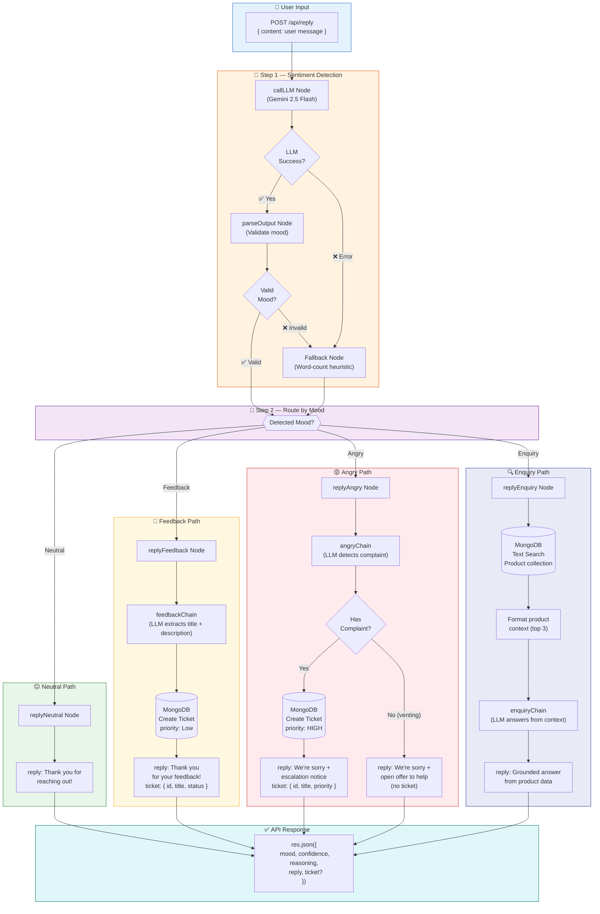

# Feedback Processing Pipeline — Architecture

## Overview

The system receives user feedback via a REST API, automatically detects the user's sentiment/mood using AI, and routes the message through the appropriate response handler. Each mood type triggers a different business action.

---

## Visual Flow



---

## How It Works

### Step 1 — Sentiment Detection

| Component | Purpose |
|-----------|---------|
| **callLLM Node** | Sends user message to Gemini 2.5 Flash to classify mood as `Angry`, `Neutral`, `Feedback`, or `Enquiry` |
| **parseOutput Node** | Validates the LLM's JSON output (mood must be one of the 4 categories, confidence 0–1) |
| **Fallback Node** | If LLM fails or returns invalid data, uses a keyword-matching heuristic to detect mood |

### Step 2 — Route by Mood

Based on the detected mood, the workflow branches into one of four paths:

---

### 😐 Neutral

| Trigger | Example Input |
|---------|--------------|
| Generic greeting or message with no clear intent | *"Hi there!"*, *"Good morning."* |

**Action:** Send a simple acknowledgment reply.  
**Ticket:** None  
**LLM Calls:** 0 (static response)

**Response:**
```json
{
  "mood": "Neutral",
  "confidence": 0.92,
  "reasoning": "Generic greeting with no specific intent",
  "reply": "Thank you for reaching out! Is there anything specific we can help you with today?"
}
```

---

### 💬 Feedback

| Trigger | Example Input |
|---------|--------------|
| Feature request, bug report, suggestion, product opinion | *"I think Alexa should support custom wake words."* |

**Action:**
1. LLM extracts a clean `title` and `description` from raw feedback
2. A ticket is created in MongoDB (status: `Open`, priority: `Low`)
3. Gratitude reply sent to user

**Ticket:** ✅ Created (Low priority)  
**LLM Calls:** 2 (sentiment + ticket extraction)

**Response:**
```json
{
  "mood": "Feedback",
  "confidence": 0.91,
  "reasoning": "User is suggesting a new feature",
  "reply": "Thank you for your feedback! We've logged it and will look into it shortly.",
  "ticket": {
    "id": "65f1a2b3...",
    "title": "Add custom wake word support",
    "status": "Open"
  }
}
```

---

### 😡 Angry — With Complaint

| Trigger | Example Input |
|---------|--------------|
| Frustrated user with a specific actionable problem | *"I was charged twice for my subscription and nobody is fixing it!"* |

**Action:**
1. LLM detects whether the anger contains a concrete complaint
2. If complaint found → ticket created with **High** priority
3. Apology + escalation notice sent to user

**Ticket:** ✅ Created (High priority)  
**LLM Calls:** 2 (sentiment + complaint detection)

**Response:**
```json
{
  "mood": "Angry",
  "confidence": 0.95,
  "reasoning": "User is angry about a billing issue",
  "reply": "We're really sorry to hear you're upset — that's not the experience we want for you. We've escalated your complaint and our team will be in touch shortly.",
  "ticket": {
    "id": "65f1a2b4...",
    "title": "Double charge on Music subscription",
    "status": "Open",
    "priority": "High"
  }
}
```

### 😡 Angry — Pure Venting

| Trigger | Example Input |
|---------|--------------|
| Frustrated user with no specific complaint | *"Ugh, Alexa is SO annoying sometimes!!!"* |

**Action:** Apology reply only. No ticket created.  
**Ticket:** ❌ None  
**LLM Calls:** 2 (sentiment + complaint check)

**Response:**
```json
{
  "mood": "Angry",
  "confidence": 0.88,
  "reasoning": "User is venting frustration",
  "reply": "We're really sorry to hear you're upset — that's not the experience we want for you. Please don't hesitate to reach out if there's anything we can do to help."
}
```

---

### 🔍 Enquiry

| Trigger | Example Input |
|---------|--------------|
| Question about product features, specs, compatibility, setup | *"Can I pair two Echo Studio speakers for stereo sound?"* |

**Action:**
1. MongoDB full-text search against the Product collection (13 seeded Alexa products)
2. Top 3 matches formatted as context
3. LLM composes a grounded answer using only the product data

**Ticket:** ❌ None  
**LLM Calls:** 2 (sentiment + answer generation)

**Response:**
```json
{
  "mood": "Enquiry",
  "confidence": 0.89,
  "reasoning": "User is asking about device capabilities",
  "reply": "Yes! You can pair two Echo Studio speakers for stereo sound. Once paired, one acts as the left channel and the other as the right, giving you a true stereo experience with Dolby Atmos spatial audio."
}
```

---

## Tech Stack

| Layer | Technology |
|-------|-----------|
| **API** | Express.js (Node.js) |
| **AI Framework** | LangChain + LangGraph |
| **LLM** | Google Gemini 2.5 Flash |
| **Database** | MongoDB (Mongoose ODM) |
| **Orchestration** | LangGraph StateGraph (nodes + conditional edges) |

---

## Project Structure

```
src/
  chains/                    ← LLM pipelines (prompt → model → parser)
    sentimentChain.js           Mood classification
    feedbackChain.js            Ticket extraction from feedback
    angryChain.js               Complaint detection in angry messages
    enquiryChain.js             Answer generation from product context
  graph/                     ← LangGraph workflow
    state.js                    Shared state schema (all fields)
    workflow.js                 Graph wiring + public processFeedback()
    nodes/
      sentimentNodes.js         callLLM, parseOutput, fallback
      replyNodes.js             replyNeutral, replyFeedback, replyAngry, replyEnquiry
  models/                    ← MongoDB schemas
    Product.js                  Alexa product catalog (13 entries)
    Ticket.js                   Support tickets (Low/High priority)
    Conversation.js             Chat history (future use)
  routes/
    reply.js                 ← POST /api/reply endpoint
  scripts/
    seedProducts.js          ← One-time DB seed for Alexa product data
```

---

## Error Handling & Resilience

| Failure | Recovery |
|---------|----------|
| LLM API unreachable | Fallback to word-count heuristic for mood detection |
| LLM returns invalid JSON | Fallback node takes over |
| Ticket creation fails | Reply still sent gracefully (no crash) |
| Product search finds nothing | Falls back to top-5 products as context |
| Enquiry LLM hangs | Error caught, static apology reply returned |
